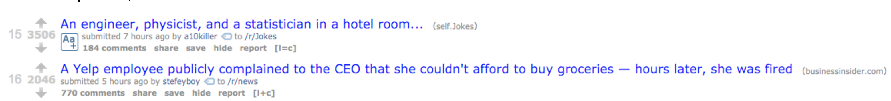

The specifics of this implementation are left to the students.  Discuss your design with your group before writing any code.

# Design

Look back on your ERD Diagram back in the modeling section.

Posts can contain two different kinds of content: links to other sites, or text.  There are a number of ways to represent this data.

*Q: What would an implementation using inheritance look like?*

*Q: What would a polymorphic implementation look like?  How would it differ from an inheritance implementation?*

**Task: Discuss with your partner some of the trade-offs using these different approaches to represent posts.**

**Task: Allow the user to create Posts that belong to a subreddit.**

**Task: Validate the content types of Posts.**

# Showing the Posts

If you like, you can try to imitate the reddit visual, but we’ll leave it to your team to determine how close you want to get.

On our subreddit page, all we need is Posts. A post’s title should either be link to the url specified or the show page for the post. url posts should also have a link to the show page for viewing comments.  Don’t forget about nested routes!

**Task: Write several user stories for posts.**

Tip: Use a partial to represent a comment and make the Post#show page loop over the comments collection.

# Linking the posts

We have two types of posts, and that means that our application has to do some work to decide how to display them: text posts have a view, and link posts do not.  In other words, we have two kinds of posts, and we need to create a common interface.

When you click the first link shown in the image above, you are taken to the show page for that post. When you click the second link, you are taken to an external source.

One good way to manage this difference is to create a single helper method that decides, based on the post type, where to direct the user. That way this method is the only place that has to know some posts link somewhere else. The view should not have to know that some posts link to different places.

*Task: Expose one method that determines where a post should link.*

# Further Reading

Consider the differences between the relational model and the object oriented model: [http://unixspace.com/context/databases.html](http://unixspace.com/context/databases.html)

